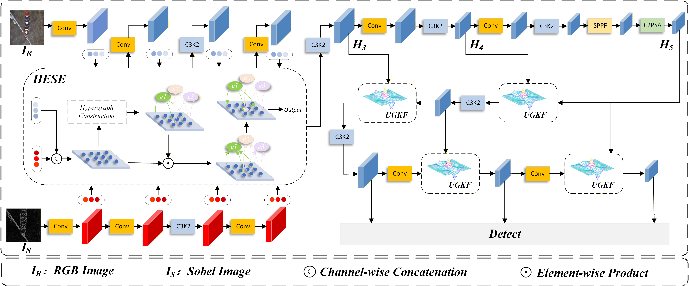

# HESUGK-Net: Hypergraph Edge-Sparse Uncertainty-Guided Kalman Gain Network for Electric Power Anomaly Detection



### 🦄 Dependencies
To run the code, make sure you have the following dependencies installed:

| Dependency | Version |
|------------|---------|
| Pytorch    | 2.3.0   |
| Python     | 3.9.19  |
| CUDA       | 12.6    |
| Ubuntu     | 22.04   |

### Install
Install the ultralytics package, including all requirements, in a Python>=3.8 environment with PyTorch>=1.8.
```bash
conda create -n HESUGK-net python=3.9.19
conda activate HESUGK-net
pip install ultralytics
pip install -r requirements.txt
pip install -e .
```

### Train
```bash
python train.py
```
### Citation
If our work assists your research, feel free to give us a star ⭐ or cite us using:

